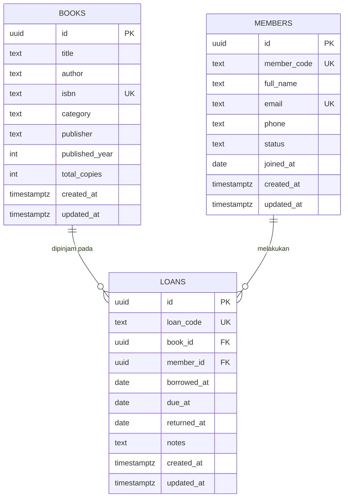

# Perpustakaan API

REST API untuk **layanan pencatatan peminjaman buku perpustakaan**. Dibangun dengan
Node.js + Express.js, data disimpan di **Supabase** (Postgres), dan API-nya dideploy
ke **Vercel** supaya bisa diakses publik.

- **Base URL:** https://perpustakaan-api-modul1-kel25.vercel.app
- **Repository:** https://github.com/farasfauzan/perpustakaan-api-modul1-kel25
- **Health check:** https://perpustakaan-api-modul1-kel25.vercel.app/health

> Semua contoh di bawah memakai base URL di atas, jadi bisa langsung di-copy-paste
> ke Postman, Insomnia, atau `curl`.

---

## 1. Deskripsi dan tujuan proyek

Praktikum ini meminta sebuah REST API sederhana untuk mencatat peminjaman buku
perpustakaan. Karena itu fokus proyek ini adalah **CRUD data peminjaman** (`loans`)
beserta **fitur filter** yang berguna di dunia nyata, tanpa membuat sistem
perpustakaan yang berlebihan.

**Tujuan:**

1. Menyediakan operasi Create, Read, Update, Delete untuk catatan peminjaman buku.
2. Menyediakan filter query pada daftar peminjaman — termasuk filter status
   seperti `GET /loans?status=Terlambat` yang diminta pada soal.
3. Menjaga integritas data: satu buku tidak bisa dipinjam melebihi jumlah salinan,
   anggota nonaktif tidak bisa meminjam, dan peminjaman ganda buku yang sama oleh
   anggota yang sama ditolak.
4. Bisa diakses publik lewat Vercel tanpa langkah instalasi apa pun dari penguji.

**Yang termasuk dalam lingkup:** manajemen buku (stok), manajemen anggota, dan
transaksi peminjaman/pengembalian.

**Yang tidak termasuk:** autentikasi pengguna, denda keterlambatan, reservasi,
 serta notifikasi email. Semua itu sengaja dikeluarkan supaya API tetap fokus pada
permintaan soal.

### Teknologi

| Bagian | Pilihan | Alasan singkat |
| --- | --- | --- |
| Runtime | Node.js 20+ (ESM) | Sesuai ketentuan soal, dan didukung penuh oleh Vercel. |
| Web framework | Express.js 5 | Standar industri, minim boilerplate, mudah dibaca penguji. |
| Database | Supabase (Postgres) | Sesuai ketentuan soal; memberi Postgres sungguhan + REST otomatis. |
| Driver data | `@supabase/supabase-js` | Klien resmi Supabase, query-nya tetap terbaca manusia. |
| Deployment | Vercel Serverless Function | Gratis, otomatis dari GitHub, URL langsung bisa diuji. |
| Validasi | Modul sendiri (`src/lib/validate.js`) | Menghindari dependency tambahan untuk kebutuhan yang sederhana. |

### Struktur file

```
.
├── api/
│   └── index.js              # entry point Vercel (semua request diarahkan ke sini)
├── scripts/
│   └── verify-api.mjs        # pemeriksa endpoint end-to-end
├── src/
│   ├── app.js                # Express app: middleware, route, error handler
│   ├── server.js             # server lokal (npm run dev / npm start)
│   ├── config.js             # pembacaan & validasi env var
│   ├── db.js                 # klien Supabase + penerjemah error Postgres
│   ├── lib/
│   │   ├── codes.js          # pembuat kode unik (PJM-…, AGT-…)
│   │   ├── dates.js          # operasi tanggal zona waktu Asia/Jakarta
│   │   ├── errors.js         # ApiError
│   │   ├── query.js          # pagination, sorting, pencarian
│   │   ├── response.js       # bentuk respons { data, meta } / { error }
│   │   └── validate.js       # validasi request body
│   └── routes/
│       ├── books.js          # /books
│       ├── members.js        # /members
│       └── loans.js          # /loans  ← inti soal
├── supabase/
│   ├── schema.sql            # tabel, view, index, trigger, hak akses
│   └── seed.sql              # data contoh (opsional)
├── .env.example
├── LICENSE
└── vercel.json
```

---

## 2. Struktur data / schema

Ada tiga tabel dan dua view. Tabel menyimpan data mentah; **view** yang dipakai
untuk membaca, supaya nilai turunan seperti `status` dan `available_copies`
selalu ikut data terbaru dan tidak pernah basi.



### Tabel `books`

| Kolom | Tipe | Keterangan |
| --- | --- | --- |
| `id` | uuid | Primary key, dibuat otomatis. |
| `title` | text | Judul buku. Wajib. |
| `author` | text | Penulis. Wajib. |
| `isbn` | text | Unik. Boleh kosong. |
| `category` | text | Contoh: `Novel`, `Teknologi`. |
| `publisher` | text | Penerbit. |
| `published_year` | int | 1500–2100. |
| `total_copies` | int | Jumlah salinan yang dimiliki perpustakaan. |
| `created_at`, `updated_at` | timestamptz | `updated_at` diperbarui otomatis oleh trigger. |

### Tabel `members`

| Kolom | Tipe | Keterangan |
| --- | --- | --- |
| `id` | uuid | Primary key. |
| `member_code` | text | Unik. Dibuat otomatis (`AGT-XXXXXX`) kalau tidak dikirim. |
| `full_name` | text | Nama anggota. Wajib. |
| `email` | text | Unik. Boleh kosong. |
| `phone` | text | Nomor telepon. |
| `status` | text | `Aktif` atau `Nonaktif`. Hanya `Aktif` yang boleh meminjam. |
| `joined_at` | date | Tanggal bergabung, default hari ini (WIB). |

### Tabel `loans`

| Kolom | Tipe | Keterangan |
| --- | --- | --- |
| `id` | uuid | Primary key. |
| `loan_code` | text | Unik. Dibuat otomatis (`PJM-YYYYMMDD-XXXX`). |
| `book_id` | uuid | Referensi ke `books.id`. Tidak boleh diubah setelah dibuat. |
| `member_id` | uuid | Referensi ke `members.id`. Tidak boleh diubah setelah dibuat. |
| `borrowed_at` | date | Tanggal pinjam, default hari ini (WIB). |
| `due_at` | date | Tenggat. Default `borrowed_at + 7 hari` (`DEFAULT_LOAN_DAYS`). |
| `returned_at` | date | `NULL` selama belum dikembalikan. |
| `notes` | text | Catatan bebas, maksimal 500 karakter. |

**Aturan yang dijaga database (CHECK constraint):**

- `due_at >= borrowed_at`
- `returned_at` kosong **atau** `returned_at >= borrowed_at`
- `books.total_copies >= 0`
- `members.status` hanya `Aktif` / `Nonaktif`
- `DELETE` buku/anggota ditolak (`ON DELETE RESTRICT`) kalau masih ada peminjaman
  yang merujuk ke sana.

### View `v_loans` — sumber data endpoint `/loans`

View ini menggabungkan `loans` + `books` + `members`, plus dua kolom hitungan:

| Kolom | Isi |
| --- | --- |
| `status` | `Dikembalikan` kalau `returned_at` terisi; `Terlambat` kalau `due_at` sudah lewat dan belum dikembalikan; sisanya `Dipinjam`. |
| `days_late` | Jumlah hari keterlambatan (`0` kalau belum terlambat / sudah dikembalikan). |
| `book_title`, `book_author`, `book_isbn` | Data buku hasil join. |
| `member_code`, `member_name`, `member_email` | Data anggota hasil join. |

Karena `status` dihitung saat dibaca, tidak ada scheduler atau cron yang perlu
dijalankan untuk menandai peminjaman terlambat.

### View `v_books`

Sama seperti tabel `books`, ditambah:

| Kolom | Isi |
| --- | --- |
| `available_copies` | `total_copies` dikurangi jumlah peminjaman yang belum dikembalikan. |
| `borrowed_copies` | Jumlah salinan yang sedang dipinjam. |

Contoh: `total_copies = 3`, 1 buku sedang dipinjam → `available_copies = 2`.
Stok tidak disimpan di kolom, jadi tidak mungkin selisih dengan kenyataan.

### Zona waktu

Semua tanggal memakai zona waktu **Asia/Jakarta (WIB)**. Baik database
(`(now() at time zone 'Asia/Jakarta')::date`) maupun API (`src/lib/dates.js`)
menghitung "hari ini" dengan cara yang sama, sehingga batas keterlambatan tidak
bergeser saat diuji tengah malam.

---

## 3. Daftar endpoint

| Method | Path | Keterangan |
| --- | --- | --- |
| `GET` | `/` | Info layanan + daftar endpoint. |
| `GET` | `/health` | Status layanan dan koneksi database. |
| `GET` | `/books` | Daftar buku. |
| `GET` | `/books/:id` | Detail satu buku. |
| `POST` | `/books` | Tambah buku. |
| `PATCH` | `/books/:id` | Ubah buku. |
| `DELETE` | `/books/:id` | Hapus buku. |
| `GET` | `/members` | Daftar anggota. |
| `GET` | `/members/:id` | Detail satu anggota. |
| `POST` | `/members` | Tambah anggota. |
| `PATCH` | `/members/:id` | Ubah anggota. |
| `DELETE` | `/members/:id` | Hapus anggota. |
| `GET` | `/loans` | **Daftar peminjaman + filter (inti soal).** |
| `GET` | `/loans/:id` | Detail satu peminjaman. |
| `POST` | `/loans` | **Catat peminjaman baru.** |
| `PATCH` | `/loans/:id` | Ubah peminjaman / tandai dikembalikan. |
| `DELETE` | `/loans/:id` | Hapus catatan peminjaman. |

Semua endpoint di atas juga bisa diakses dengan prefix `/api`
(mis. `https://perpustakaan-api-modul1-kel25.vercel.app/api/loans`).

### Parameter filter `GET /loans`

| Parameter | Contoh | Fungsi |
| --- | --- | --- |
| `status` | `?status=Terlambat` | `Dipinjam`, `Terlambat`, atau `Dikembalikan`. Tidak peka huruf besar/kecil. |
| `member_id` | `?member_id=<uuid>` | Peminjaman milik satu anggota. |
| `book_id` | `?book_id=<uuid>` | Peminjaman satu judul buku. |
| `member_code` | `?member_code=AGT-0001` | Cari berdasarkan kode anggota (boleh sebagian). |
| `q` | `?q=fowler` | Cari di kode pinjam, judul, penulis, nama/kode anggota. |
| `borrowed_from` | `?borrowed_from=2026-09-01` | Pinjam pada/setelah tanggal ini. |
| `borrowed_to` | `?borrowed_to=2026-09-30` | Pinjam pada/sebelum tanggal ini. |
| `sort` | `?sort=-due_at` | `created_at`, `updated_at`, `borrowed_at`, `due_at`, `returned_at`, `loan_code`, `status`. Awali `-` untuk menurun. |
| `page`, `limit` | `?page=2&limit=10` | Default `page=1`, `limit=20`, maksimal `limit=100`. |

Parameter serupa berlaku untuk `GET /books` (`q`, `category`, `available`,
`sort`, `page`, `limit`) dan `GET /members` (`q`, `status`, `sort`, `page`,
`limit`).

Bentuk respons:

- Objek tunggal → `{ "data": { ... } }`
- Daftar → `{ "data": [ ... ], "meta": { "page", "limit", "total", "total_pages" } }`
- Error → `{ "error": { "code", "message", "details" } }`

---

## 4. Contoh request dan response

Semua contoh memakai base URL deployment dan id dari data contoh
(`supabase/seed.sql`), jadi bisa langsung di-copy-paste ke terminal, Postman,
atau Insomnia.

Nilai yang dibuat otomatis oleh server (`id`, `member_code`, `loan_code`,
`created_at`, `updated_at`, dan tanggal yang tidak dikirim) tentu berbeda
setiap kali dipanggil; contoh di bawah hanya menunjukkan bentuknya. Contoh `PATCH` dan
`DELETE` mengubah data contoh tersebut — jalankan ulang `supabase/seed.sql` di
Supabase SQL Editor untuk mengembalikan kondisi awal.

### 4.1 `GET /` — cek layanan

```bash
curl https://perpustakaan-api-modul1-kel25.vercel.app/
```

```json
{
  "service": "perpustakaan-api",
  "description": "REST API pencatatan peminjaman buku perpustakaan.",
  "version": "1.0.0",
  "status": "ok",
  "timezone": "Asia/Jakarta",
  "routes": [{ "method": "GET", "path": "/loans", "description": "Daftar peminjaman (…)" }]
}
```

### 4.2 `GET /health` — pastikan database hidup

```bash
curl https://perpustakaan-api-modul1-kel25.vercel.app/health
```

```json
{ "status": "ok", "database": { "connected": true, "latency_ms": 41 } }
```

### 4.3 `POST /books` — tambah buku

```bash
curl -X POST https://perpustakaan-api-modul1-kel25.vercel.app/books \
  -H "Content-Type: application/json" \
  -d '{
    "title": "Pemrograman Berorientasi Objek",
    "author": "Adi Nugroho",
    "isbn": "9789792912456",
    "category": "Teknologi",
    "publisher": "Andi",
    "published_year": 2016,
    "total_copies": 3
  }'
```

```json
{
  "data": {
    "id": "ef12a4a2-5ea0-460b-99d0-ae86efd54ea0",
    "title": "Pemrograman Berorientasi Objek",
    "author": "Adi Nugroho",
    "isbn": "9789792912456",
    "category": "Teknologi",
    "publisher": "Andi",
    "published_year": 2016,
    "total_copies": 3,
    "available_copies": 3,
    "borrowed_copies": 0,
    "created_at": "2026-10-06T11:20:38.745+00:00",
    "updated_at": "2026-10-06T11:20:38.745+00:00"
  }
}
```

ISBN bersifat unik, jadi kirim `409 CONFLICT` kalau ISBN-nya sudah terdaftar —
misalnya kalau contoh di atas dijalankan dua kali.

### 4.4 `GET /books?q=&available=` — cari buku yang masih tersedia

```bash
curl "https://perpustakaan-api-modul1-kel25.vercel.app/books?q=clean%20code&available=true&limit=5"
```

```json
{
  "data": [
    {
      "id": "b0000001-0000-4000-8000-000000000004",
      "title": "Clean Code",
      "total_copies": 2,
      "available_copies": 1,
      "borrowed_copies": 1
    }
  ],
  "meta": { "page": 1, "limit": 5, "total": 1, "total_pages": 1 }
}
```

### 4.5 `POST /members` — tambah anggota

`member_code` boleh dikosongkan; API akan membuatnya sendiri.

```bash
curl -X POST https://perpustakaan-api-modul1-kel25.vercel.app/members \
  -H "Content-Type: application/json" \
  -d '{
    "full_name": "Dewi Lestari",
    "email": "dewi@students.undip.ac.id",
    "phone": "081200000006"
  }'
```

```json
{
  "data": {
    "id": "a6d813d6-37f5-482d-bf20-bf572be7cf16",
    "member_code": "AGT-MT7Q8D",
    "full_name": "Dewi Lestari",
    "email": "dewi@students.undip.ac.id",
    "phone": "081200000006",
    "status": "Aktif",
    "joined_at": "2026-10-06"
  }
}
```

Email juga unik, jadi `409 CONFLICT` kalau email-nya sudah dipakai.

### 4.6 `POST /loans` — catat peminjaman

`due_at` boleh dikosongkan; default 7 hari setelah `borrowed_at`.

```bash
curl -X POST https://perpustakaan-api-modul1-kel25.vercel.app/loans \
  -H "Content-Type: application/json" \
  -d '{
    "book_id": "b0000001-0000-4000-8000-000000000001",
    "member_id": "a0000001-0000-4000-8000-000000000002",
    "notes": "Dipinjam untuk tugas akhir."
  }'
```

```json
{
  "data": {
    "id": "4a8a976d-7fd6-45e4-910e-8f18ec01c997",
    "loan_code": "PJM-20261006-AMMC",
    "book_id": "b0000001-0000-4000-8000-000000000001",
    "member_id": "a0000001-0000-4000-8000-000000000002",
    "borrowed_at": "2026-10-06",
    "due_at": "2026-10-13",
    "returned_at": null,
    "notes": "Dipinjam untuk tugas akhir.",
    "status": "Dipinjam",
    "days_late": 0,
    "book_title": "Laskar Pelangi",
    "book_author": "Andrea Hirata",
    "book_isbn": "9789793062792",
    "member_code": "AGT-0002",
    "member_name": "Ade Raihan Hakim",
    "member_email": "ade@students.undip.ac.id",
    "created_at": "2026-10-06T11:25:34.009+00:00",
    "updated_at": "2026-10-06T11:25:34.009+00:00"
  }
}
```

Kalau stoknya habis — contohnya buku `Buku Tanpa Salinan` pada data contoh —
API membalas `409`:

```json
{
  "error": {
    "code": "CONFLICT",
    "message": "Semua salinan \"Buku Tanpa Salinan\" sedang dipinjam (0 eksemplar)."
  }
}
```

### 4.7 `GET /loans?status=Terlambat` — filter status (contoh pada soal)

```bash
curl "https://perpustakaan-api-modul1-kel25.vercel.app/loans?status=Terlambat&limit=5"
```

```json
{
  "data": [
    {
      "loan_code": "PJM-CONTOH-0003",
      "book_title": "Clean Code",
      "member_name": "Nadia Puspita Sari",
      "borrowed_at": "2026-09-15",
      "due_at": "2026-09-22",
      "returned_at": null,
      "status": "Terlambat",
      "days_late": 8
    }
  ],
  "meta": { "page": 1, "limit": 5, "total": 1, "total_pages": 1 }
}
```

Filter gabungan juga bisa:

```bash
curl "https://perpustakaan-api-modul1-kel25.vercel.app/loans?status=Dipinjam&member_code=AGT-0001&sort=-due_at&page=1&limit=10"
curl "https://perpustakaan-api-modul1-kel25.vercel.app/loans?borrowed_from=2026-09-01&borrowed_to=2026-09-30&q=clean"
```

### 4.8 `GET /loans/:id` — detail

Contoh 4.8–4.10 memakai satu peminjaman pada data contoh (`PJM-CONTOH-0006`),
jadi bisa langsung dijalankan berurutan: baca → tandai dikembalikan → hapus.

```bash
curl https://perpustakaan-api-modul1-kel25.vercel.app/loans/c0000001-0000-4000-8000-000000000006
```

```json
{
  "data": {
    "loan_code": "PJM-CONTOH-0006",
    "status": "Dipinjam",
    "days_late": 0,
    "due_at": "2026-10-07"
  }
}
```

### 4.9 `PATCH /loans/:id` — ubah / tandai dikembalikan

Mengembalikan buku = mengisi `returned_at`. Kirim `"returned_at": null` untuk
membatalkan pengembalian.

```bash
curl -X PATCH https://perpustakaan-api-modul1-kel25.vercel.app/loans/c0000001-0000-4000-8000-000000000006 \
  -H "Content-Type: application/json" \
  -d '{ "returned_at": "2026-10-02", "notes": "Dikembalikan, kondisi baik." }'
```

```json
{
  "data": {
    "loan_code": "PJM-CONTOH-0006",
    "borrowed_at": "2026-09-30",
    "due_at": "2026-10-07",
    "returned_at": "2026-10-02",
    "status": "Dikembalikan",
    "days_late": 0
  }
}
```

### 4.10 `DELETE /loans/:id`

```bash
curl -i -X DELETE https://perpustakaan-api-modul1-kel25.vercel.app/loans/c0000001-0000-4000-8000-000000000006
```

```
HTTP/1.1 204 No Content
```

### 4.11 Contoh error

| Kondisi | Status | `error.code` |
| --- | --- | --- |
| Body bukan JSON / field asing | 400 | `INVALID_JSON`, `BAD_REQUEST` |
| Id bukan UUID / field wajib kosong | 422 | `VALIDATION_ERROR` |
| Id tidak ditemukan | 404 | `NOT_FOUND` |
| Route tidak ada | 404 | `ROUTE_NOT_FOUND` |
| Stok habis, anggota nonaktif, ISBN duplikat, hapus data yang masih dipakai | 409 | `CONFLICT` |
| Env Supabase belum diisi | 503 | `SUPABASE_NOT_CONFIGURED` |

```json
{
  "error": {
    "code": "VALIDATION_ERROR",
    "message": "Field \"due_at\" tidak boleh lebih awal dari \"borrowed_at\"."
  }
}
```

---

## 5. Panduan instalasi dan cara menjalankan lokal

### 5.1 Prasyarat

- Node.js 20 atau lebih baru (`node -v`)
- npm
- Akun Supabase (gratis) dan satu project

### 5.2 Siapkan database Supabase

1. Masuk ke [supabase.com/dashboard](https://supabase.com/dashboard), buat project baru.
2. Tunggu sampai project selesai provisioning (sekitar 2 menit).
3. Buka **SQL Editor** → **New query**, tempel seluruh isi
   `supabase/schema.sql`, lalu **Run**. Ini membuat tiga tabel, dua view, index,
   trigger, dan hak akses.
4. (Opsional, disarankan) Ulangi untuk `supabase/seed.sql` supaya langsung ada
   data contoh dengan ketiga status peminjaman.
5. Buka **Project Settings → API**, catat:
   - `Project URL` → dipakai sebagai `SUPABASE_URL`
   - `service_role` secret → dipakai sebagai `SUPABASE_SERVICE_ROLE_KEY`

### 5.3 Jalankan di lokal

```bash
git clone https://github.com/farasfauzan/perpustakaan-api-modul1-kel25.git
cd perpustakaan-api
npm install
cp .env.example .env        # Windows PowerShell: Copy-Item .env.example .env
```

Isi `.env`:

```dotenv
PORT=3000
SUPABASE_URL=https://xxxxxxxxxxxxxxxx.supabase.co
SUPABASE_SERVICE_ROLE_KEY=isi_service_role_key_anda
DEFAULT_LOAN_DAYS=7
MAX_PAGE_SIZE=100
```

Jalankan:

```bash
npm run dev     # node --watch, otomatis restart saat file berubah
npm start       # tanpa watch
```

Server siap di `http://localhost:3000`. Cek cepat:

```bash
curl http://localhost:3000/health
```

### 5.4 Variabel environment

| Variabel | Wajib | Default | Keterangan |
| --- | --- | --- | --- |
| `SUPABASE_URL` | ya | — | URL project Supabase. |
| `SUPABASE_SERVICE_ROLE_KEY` | ya | — | Kunci service role; hanya dipakai di server. |
| `PORT` | tidak | `3000` | Port server lokal (diabaikan Vercel). |
| `DEFAULT_LOAN_DAYS` | tidak | `7` | Lama pinjam default kalau `due_at` tidak dikirim. |
| `MAX_PAGE_SIZE` | tidak | `100` | Batas atas parameter `limit`. |

### 5.5 Verifikasi semua endpoint sekaligus

Setelah server hidup (lokal atau Vercel), jalankan pemeriksa end-to-end:

```bash
npm run verify
# atau menuju deployment publik
node scripts/verify-api.mjs https://perpustakaan-api-modul1-kel25.vercel.app
```

Skrip `scripts/verify-api.mjs` membuat datanya sendiri, menguji seluruh endpoint
termasuk jalur error (400/404/409/422), lalu menghapus kembali data yang dibuat.

### 5.6 Deploy ulang ke Vercel

```bash
npm i -g vercel
vercel login
vercel --prod
```

Saat membuat project, set environment variable `SUPABASE_URL` dan
`SUPABASE_SERVICE_ROLE_KEY` di **Project Settings → Environment Variables**
(centang Production, Preview, dan Development), lalu redeploy. Vercel otomatis
mengarahkan semua request ke `api/index.js` lewat `vercel.json`.

---

## 6. Hasil deployment

- **Base URL:** https://perpustakaan-api-modul1-kel25.vercel.app
- **Health check:** https://perpustakaan-api-modul1-kel25.vercel.app/health
- **Contoh filter sesuai soal:** https://perpustakaan-api-modul1-kel25.vercel.app/loans?status=Terlambat

Uji cepat tanpa alat tambahan — buka di browser:

| Tujuan | URL |
| --- | --- |
| Info layanan + daftar route | https://perpustakaan-api-modul1-kel25.vercel.app/ |
| Status database | https://perpustakaan-api-modul1-kel25.vercel.app/health |
| Semua peminjaman | https://perpustakaan-api-modul1-kel25.vercel.app/loans |
| Peminjaman terlambat | https://perpustakaan-api-modul1-kel25.vercel.app/loans?status=Terlambat |
| Yang sedang dipinjam | https://perpustakaan-api-modul1-kel25.vercel.app/loans?status=Dipinjam |
| Yang sudah dikembalikan | https://perpustakaan-api-modul1-kel25.vercel.app/loans?status=Dikembalikan |
| Daftar buku + sisa stok | https://perpustakaan-api-modul1-kel25.vercel.app/books |
| Buku yang masih tersedia | https://perpustakaan-api-modul1-kel25.vercel.app/books?available=true |
| Daftar anggota aktif | https://perpustakaan-api-modul1-kel25.vercel.app/members?status=Aktif |

---
